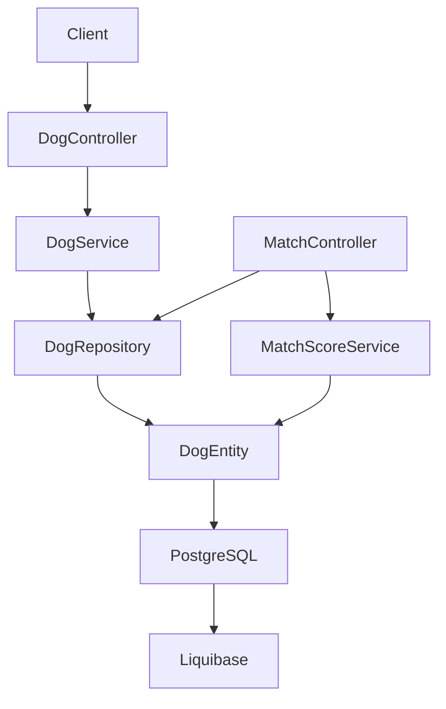
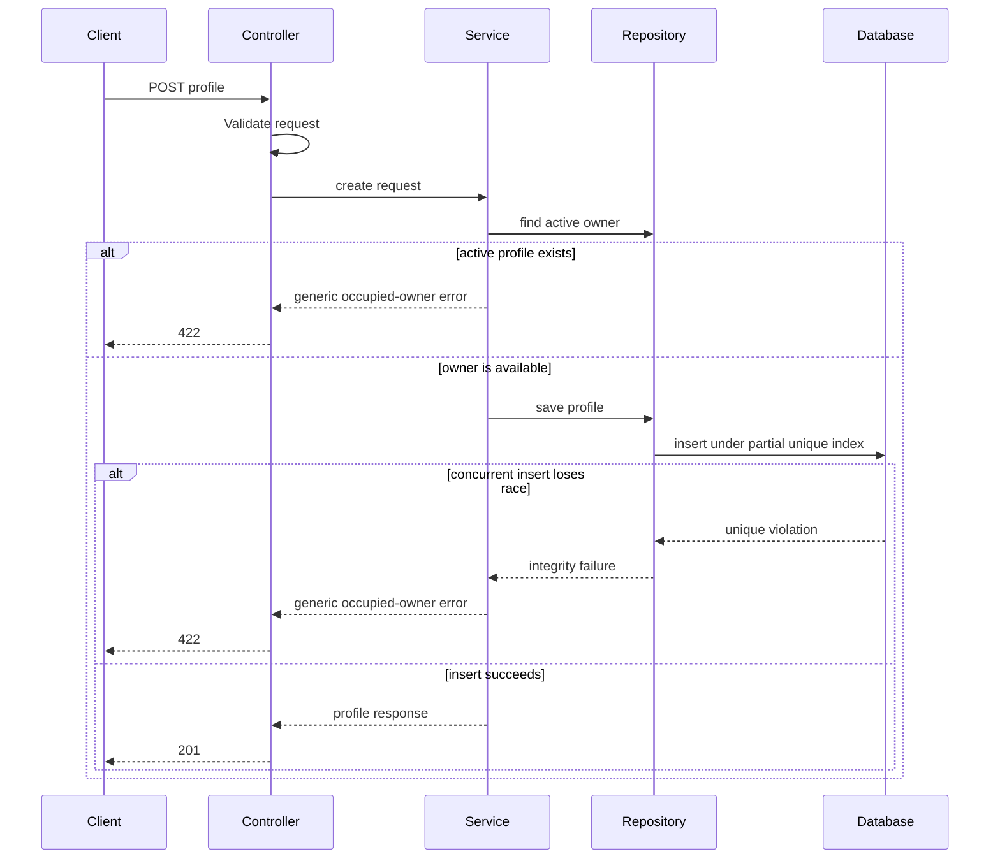
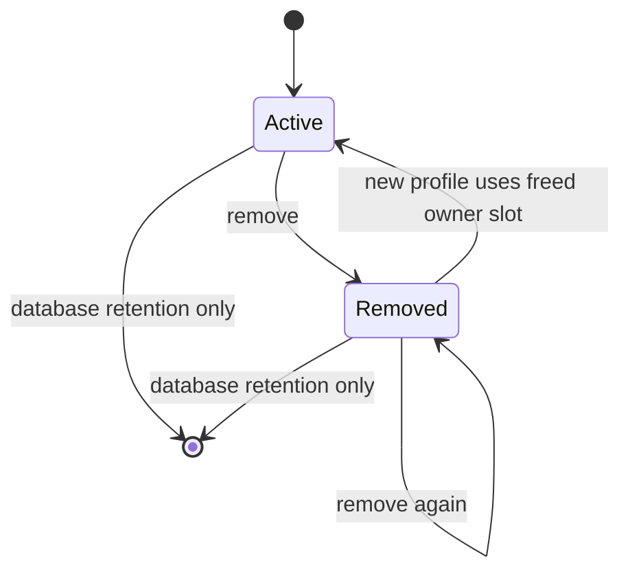
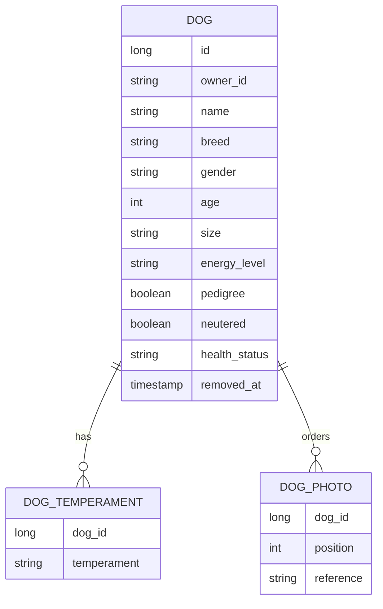
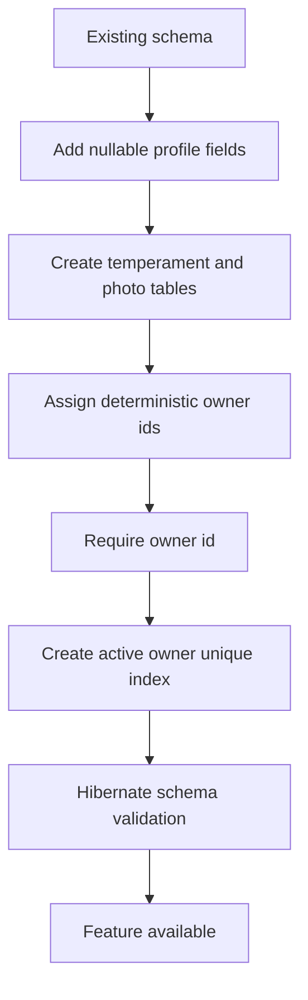

# Design Document

## Overview

This feature extends the existing dog vertical slice into a complete profile
lifecycle for private owners. It adds structured play attributes, optional
self-declared mating attributes, ordered photo references, ownership by an
opaque caller-supplied identifier, incremental updates, derived completeness,
and soft removal.

The design preserves the existing package-per-concept structure and keeps
matching dependent on `dog` without changing its scoring algorithm. New domain
rules belong in `DogService`; controllers remain HTTP adapters and the
repository remains the persistence boundary.

### Goals

- Represent all F-02 profile attributes with values that can later be compared.
- Enforce one active profile per owner, including concurrent creates.
- Support create, read, partial update, soft removal, and derived completeness.
- Preserve existing profiles, matching behavior, and the corrupt legacy age row.
- Keep profile creation minimal: only name, breed, gender, age, and owner id are
  required.

### Non-Goals

- Authentication or owner accounts from F-01.
- Play/mating mode activation or conditional mating-field requirements from F-03.
- Changes to `MatchScoreService` or score weights from F-04.
- Photo upload, binary storage, image processing, geolocation, filtering, or
  multiple dogs per owner.

## Boundary Commitments

### This Spec Owns

- The `Dog` profile data and its create/read/update/soft-remove behavior.
- Validation of profile fields and fixed vocabulary membership.
- The opaque owner identifier and one-active-profile invariant.
- The profile API error contract, including field errors and generic occupied-
  owner rejection.
- Exclusion of removed dogs from list and matching reads.
- The Liquibase migration and compatibility of existing dog rows.

### Out of Boundary

- Authentication, authorization, and proof that an owner identifier belongs to
  the caller; F-01 will provide that later.
- Owner entities, owner endpoints, owner lifecycle, and account deletion.
- Mode state and mating-field gating; F-03 owns those rules.
- Compatibility scoring; F-04 may consume the new fields later but this design
  leaves `MatchScoreService` unchanged.
- Storage or validation of image bytes; photo values are references only.

### Allowed Dependencies

- `dog` may use Spring MVC validation, Spring Data JPA, PostgreSQL and
  Liquibase already present in the project.
- `match` may use `DogRepository`'s active-profile query to exclude removed
  dogs. `dog` must not depend on `match`.
- Existing Spring Boot, Kotlin, Jakarta Validation and JUnit/AssertJ
  dependencies are reused; no new library is introduced.

### Revalidation Triggers

- Changing request or response fields, enum values, photo ordering, or error
  status/body contracts.
- Replacing the opaque owner identifier with authenticated identity or an owner
  entity.
- Allowing multiple active dogs per owner.
- Making mating attributes required by a mode.
- Making matching score any newly added attribute.
- Changing the active/removed visibility rules or migration assumptions.

## Architecture

### Existing Architecture Analysis

The current `dog` package contains `Dog`, `DogRepository`, and
`DogController`. The controller currently writes directly to the repository,
with Bean Validation on `DogRequest`. There is no service, advice, update or
delete operation. `match` reads the same repository and owns scoring in
`MatchScoreService`.

The extension introduces a service because ownership, lifecycle, completeness,
validation conversion and duplicate-owner handling are domain rules. The
controller delegates to it. Repository methods distinguish active list/match
reads from direct reads, allowing removed profiles to remain fetchable by id.

### Architecture Pattern & Boundary Map

Selected pattern: package-per-concept vertical slice with controller → service
→ repository/entity dependency direction. PostgreSQL supplies the atomic
partial unique index; the service supplies the user-facing pre-check and maps a
concurrent integrity failure to the same generic 422.



Existing patterns preserved: constructor injection, immutable request/response
DTOs, JPA mutable entities, eager collections with `open-in-view: false`,
plain-SQL Liquibase changesets, 404 for absence and 422 for unusable stored or
business data. No new runtime dependency is required.

### Technology Stack

| Layer | Choice / Version | Role in Feature | Notes |
|-------|------------------|-----------------|-------|
| HTTP | Spring Boot 4.1 MVC | Dog CRUD-like endpoints and error responses | Existing stack; `PATCH` is used for incremental updates |
| Validation | Jakarta Bean Validation | Required-field, age, owner and vocabulary validation | Custom vocabulary constraint is local to the dog package |
| Domain | Kotlin 2.3, JVM 25 | `DogService`, enums, completeness and lifecycle rules | Official Kotlin style; no wildcard imports |
| Persistence | Spring Data JPA, Hibernate 7 | Entity mapping and repository queries | `ddl-auto: validate`; collections fetched eagerly |
| Database | PostgreSQL 18 | Profile data, child collections and partial unique index | Existing database; no new dependency |
| Schema | Liquibase plain SQL | Additive migration and legacy backfill | New file `005-dog-profile.sql`; master index append only |
| Tests | JUnit 5, AssertJ, Spring Boot test classpath | Service, controller contract and matching regression tests | Prefer direct unit tests; no database is required for unit tests |

## File Structure Plan

### Directory Structure

```text
src/main/kotlin/com/ai4dev/tinder4dogs/dog/
├── Dog.kt                 # Entity and profile enums
├── DogController.kt       # HTTP DTOs, routes and response mapping
├── DogRepository.kt       # Active/direct lookup and owner queries
├── DogService.kt          # Profile rules, lifecycle and persistence orchestration
└── DogValidation.kt       # Fixed-vocabulary request constraint and dog errors

src/main/kotlin/com/ai4dev/tinder4dogs/match/
└── MatchController.kt     # Exclude removed dogs from matching reads

src/main/resources/db/changelog/
├── db.changelog-master.yaml       # Append migration 005
└── changes/005-dog-profile.sql    # Additive schema and deterministic backfill

src/test/kotlin/com/ai4dev/tinder4dogs/dog/
├── DogServiceTest.kt       # Pure domain and lifecycle behavior
└── DogControllerTest.kt    # HTTP validation/error contract where needed

src/test/kotlin/com/ai4dev/tinder4dogs/match/
└── MatchControllerTest.kt  # Removed profile visibility in matching
```

### New Files

- `dog/DogService.kt` — owns profile creation, patching, removal, duplicate
  owner handling and completeness calculation.
- `dog/DogValidation.kt` — vocabulary constraint, validation error envelope,
  and dog-specific exception handling. It must not affect match responses.
- `005-dog-profile.sql` — schema additions, child tables/indexes, and existing
  row backfill.
- `DogServiceTest.kt` — service behavior with repository test doubles.
- `DogControllerTest.kt` — request/response validation behavior if direct
  controller tests cannot cover advice mapping.
- `MatchControllerTest.kt` — active-only matching behavior.

### Modified Files

- `dog/Dog.kt` — new nullable entity fields, enums, `removedAt`, owner id,
  temperament collection and ordered photo collection.
- `dog/DogRepository.kt` — active list, active owner lookup, active match lookup,
  and direct id lookup support.
- `dog/DogController.kt` — expanded DTOs, `PATCH`, soft-delete route, service
  delegation and completeness/removed response fields.
- `match/MatchController.kt` — use active-only repository reads for subjects
  and candidates; `MatchScoreService` remains unchanged.
- `db.changelog-master.yaml` — append include for `005-dog-profile.sql`.

## System Flows

### Create and duplicate-owner flow



### Profile visibility state



A removed row is retained and directly readable, but active list queries and
match queries exclude it. Creating a replacement creates a separate active row;
there is no restore operation in this scope.

## Requirements Traceability

| Requirement | Summary | Components | Interfaces | Flows |
|-------------|---------|------------|------------|-------|
| 1.1 | Ordered size vocabulary | DogService, Dog.kt | Create/Patch/Response | Profile validation |
| 1.2 | Ordered energy vocabulary | DogService, Dog.kt | Create/Patch/Response | Profile validation |
| 1.3 | Temperament vocabulary set | DogService, Dog.kt | Create/Patch/Response | Profile validation |
| 1.4 | Invalid vocabulary identifies field | DogValidation | Validation error | Profile validation |
| 1.5 | Optional attributes read explicitly | DogController | Response | Read profile |
| 1.6 | Preferences stay distinct | Dog.kt, DogService | Profile mapping | Create/Patch |
| 2.1 | Mating declarations | Dog.kt, DogController | Request/Response | Create/Patch |
| 2.2 | Mating fields optional | DogService | Create/Patch | Create profile |
| 2.3 | Self-declared values | Dog.kt, DogService | Response semantics | Create/Patch |
| 2.4 | No document verification | Boundary only | No upload contract | Create/Patch |
| 2.5 | Missing mating values accepted | DogService | Create/Patch | Create profile |
| 3.1 | Ordered references | Dog.kt, DogService | Photo list contract | Create/Patch |
| 3.2 | Empty photo list accepted | DogService | Request/Response | Create profile |
| 3.3 | Maximum six references | DogValidation | Validation error | Profile validation |
| 3.4 | First photo primary | DogController | Response `primaryPhoto` | Read profile |
| 3.5 | Full photo replacement | DogService | PATCH semantics | Update profile |
| 3.6 | No image bytes | Boundary only | Reference-only contract | Create/Patch |
| 4.1 | Minimal create | DogController, DogService | POST | Create profile |
| 4.2 | Required-field errors | DogValidation | Field error envelope | Profile validation |
| 4.3 | Negative age rejected for input | DogValidation | Field error | Profile validation |
| 4.4 | Created identifier returned | DogController | 201 response | Create profile |
| 4.5 | New fields optional at create | DogService | POST | Create profile |
| 5.1 | Owner id persisted | Dog.kt, DogService | Create/Response | Create profile |
| 5.2 | Owner id format validation | DogValidation | Field error | Profile validation |
| 5.3 | Generic duplicate rejection | DogService, DogValidation | 422 generic error | Duplicate-owner flow |
| 5.4 | Available owner permitted | DogService | POST | Create profile |
| 5.5 | Owner id is unverified claim | Boundary/API contract | `ownerId` response | Create profile |
| 5.6 | Existing rows backfilled | 005 migration | Schema migration | Deployment |
| 5.7 | Legacy invalid age preserved | 005 migration, DogService | Direct read | Deployment/read |
| 6.1 | Patch applies changes | DogController, DogService | PATCH | Update profile |
| 6.2 | Missing target 404 | DogController | 404 | Update profile |
| 6.3 | Patch uses create validation | DogValidation, DogService | Field errors | Profile validation |
| 6.4 | Owner cannot change | DogService | No owner in patch | Update profile |
| 6.5 | One optional field independently set | DogService | Absent means unchanged | Update profile |
| 7.1 | Completeness definition | DogService | `complete` response field | Read profile |
| 7.2 | Mating fields excluded | DogService | Completeness contract | Read profile |
| 7.3 | Completeness returned | DogController | Response | Read profile |
| 7.4 | Completeness is derived live | DogService | Response | Update/read |
| 8.1 | Soft removal retains data | DogService, Dog.kt | DELETE | Visibility state |
| 8.2 | Removed excluded from lists/matches | Repository, MatchController | Active queries | Matching visibility |
| 8.3 | Removed direct read | DogRepository, DogController | GET by id | Read profile |
| 8.4 | Removed frees slot | Repository, migration index | POST | Create profile |
| 8.5 | Missing remove target 404 | DogController | 404 | Remove profile |
| 8.6 | Removal idempotent | DogService | DELETE | Visibility state |
| 9.1 | Active old profiles listed | Repository, DogController | GET list | Read profile |
| 9.2 | Missing new values tolerated | Dog.kt, DogController | Nullable response fields | Read profile |
| 9.3 | Scoring unchanged | MatchScoreService | Existing score contract | Matching visibility |
| 9.4 | Corrupt direct read tolerated | DogController | GET by id | Read profile |
| 9.5 | Unknown id 404 | DogRepository, DogController | 404 | Read profile |

## Components and Interfaces

| Component | Domain/Layer | Intent | Requirements | Key Dependencies | Contracts |
|-----------|--------------|--------|--------------|------------------|-----------|
| `DogController` | HTTP | Translate profile requests and responses | 1, 2, 3, 4, 6, 7, 8, 9 | `DogService` P0 | API |
| `DogService` | Domain | Enforce profile rules and lifecycle | 1, 2, 3, 4, 5, 6, 7, 8 | `DogRepository` P0 | Service, State |
| `DogRepository` | Persistence | Provide direct and active dog queries | 5, 8, 9 | JPA P0 | State |
| `DogValidation` | HTTP validation | Validate request vocabulary and map errors | 1.4, 3.3, 4.2, 4.3, 5.2, 6.3 | Jakarta Validation P0 | API |
| `Dog` | Domain data | Persist the profile aggregate | 1, 2, 3, 5, 7, 8, 9 | JPA P0 | State |
| `MatchController` | Adjacent HTTP | Exclude removed dogs from matches | 8.2, 9.3 | `DogRepository` P0 | API |
| `005-dog-profile.sql` | Schema | Add fields, collections, index and backfill | 5.6, 5.7, 8.4 | Liquibase/PostgreSQL P0 | State |

### Dog Domain

#### Dog

**Responsibilities & Constraints**

- Own all profile attributes, preference values, photo ordering and removal
  state.
- Keep `ownerId` immutable through the update contract.
- Use nullable new scalar fields and empty child collections for legacy rows.
- Use fixed enum values internally:
  - `Size`: `SMALL`, `MEDIUM`, `LARGE`
  - `EnergyLevel`: `LOW`, `MEDIUM`, `HIGH`
  - `Temperament`: `PLAYFUL`, `CALM`, `FRIENDLY`, `SHY`, `PROTECTIVE`,
    `INDEPENDENT`, `ANXIOUS`, `GENTLE`
  - `HealthStatus`: `HEALTHY`, `UNDER_TREATMENT`, `CHRONIC_CONDITION`
- `removedAt == null` means active; non-null means removed.

**Data mapping**

- `ownerId: String`, trimmed and persisted as a non-null value of 1–100
  characters. The contents are opaque and are not interpreted as a UUID.
- `size: Size?`, `energyLevel: EnergyLevel?`, `healthStatus: HealthStatus?`.
- `temperaments: MutableSet<Temperament>`, eager, empty for legacy rows.
- `photos: MutableList<DogPhoto>`, eager and ordered by `position`.
- `pedigree: Boolean?`, `neutered: Boolean?`.
- `removedAt: Instant?` or the project-compatible timestamp type.

`DogPhoto` is a small persistence value/entity owned by `Dog`, containing the
reference and zero-based position. Its identity is the dog id plus position;
photo bytes never enter the model.

#### DogService

**Responsibilities & Constraints**

- Validate and normalize request values before repository writes.
- Compute `complete` from name, breed, gender, non-negative age, size, energy,
  at least one temperament and at least one photo; mating fields do not count.
- Check active owner occupancy before save and catch the database uniqueness
  failure around save. Both paths return one internal duplicate-owner error.
- Mark removal once and never overwrite the original timestamp.
- Read direct ids without the active predicate; list only active profiles.

**Service interface**

```kotlin
interface DogService {
    fun listActive(): List<DogProfile>
    fun get(id: Long): DogProfile
    fun create(request: CreateDogProfile): DogProfile
    fun update(id: Long, request: UpdateDogProfile): DogProfile
    fun remove(id: Long): DogProfile
}
```

`DogProfile` is a response-ready domain projection containing the `Dog`,
`complete`, and removal state. `get` and mutation methods use a not-found
result that the controller maps to 404; invalid input maps to field errors;
duplicate active owner maps to a generic 422.

**State management**

- Create, patch and remove each execute as one transaction.
- Patch treats absent fields as unchanged. The `photos` field, when present,
  replaces the full ordered list. Owner id is not accepted by the patch DTO.
- Removal is idempotent and preserves the first `removedAt`.

### HTTP API

#### DogController API Contract

| Method | Endpoint | Request | Success | Errors |
|--------|----------|---------|---------|--------|
| GET | `/api/dogs` | none | 200 active profiles | none |
| GET | `/api/dogs/{id}` | path id | 200, including removed flag | 404 unknown id |
| POST | `/api/dogs` | create request | 201 profile with id | 400 field errors, 422 generic occupied owner |
| PATCH | `/api/dogs/{id}` | partial update request | 200 updated profile | 400 field errors, 404 unknown id |
| DELETE | `/api/dogs/{id}` | none | 204; repeated delete remains 204 | 404 unknown id |

Create request fields: `ownerId`, `name`, `breed`, `gender`, `age`, and optional
`size`, `energyLevel`, `temperaments`, `photos`, `pedigree`, `neutered`,
`healthStatus`, `preferences`.

Patch request fields are the same except `ownerId` is absent; absent means
unchanged. A present `photos` array replaces all photos and may be empty.

Response fields include `id`, `ownerId`, `name`, `breed`, `gender`, `age`, all
optional profile fields, `preferences`, `photos`, `primaryPhoto`, `complete`,
and `removed`. `primaryPhoto` is null for an empty photo list.

The field error body is a stable JSON problem response with HTTP 400 and an
`errors` object keyed by request field. The occupied-owner response is HTTP 422
with a generic problem detail and no `errors` object or owner-specific wording.

### Persistence

#### DogRepository

The repository retains direct `findById(id)` for profile reads and adds:

```kotlin
fun findAllByRemovedAtIsNull(): List<Dog>
fun findByOwnerIdAndRemovedAtIsNull(ownerId: String): Optional<Dog>
fun findByIdAndRemovedAtIsNull(id: Long): Optional<Dog>
```

Match list and pairwise lookup use active-only methods. Direct profile reads use
`findById` so removed records remain visible by id.

#### Liquibase migration `005-dog-profile.sql`

The migration is append-only and included after `004-legacy-dog-row.sql`. It:

1. Adds nullable `owner_id`, profile scalar columns and `removed_at` to `dog`.
2. Creates temperament and ordered photo child tables with dog foreign keys
   and cascade deletion of child rows.
3. Assigns every existing dog a distinct deterministic owner id derived from
   its id, including `Nonna`; it does not alter `age`.
4. Makes `owner_id` non-null after backfill.
5. Creates a unique partial index over `owner_id` where `removed_at IS NULL`.
6. Provides rollback in reverse dependency order, subject to normal Liquibase
   changeset immutability rules.

The SQL must use PostgreSQL-compatible enum representation as strings, matching
existing `@Enumerated(EnumType.STRING)` mappings. No age check constraint is
introduced.

## Data Models

### Domain Model

`Dog` is the aggregate root. `DogPhoto` and temperament values are owned child
state; preferences remain the pre-existing activity-tag collection. There is no
owner aggregate because `ownerId` is intentionally an unverified opaque value.



### Logical Data Model

- `dog.id` remains the primary identifier.
- `dog.owner_id` is the opaque ownership key and is unique only among active
  rows.
- `dog_preference` remains unchanged and continues to represent activity
  preferences, not structured traits.
- `dog_temperament` has `(dog_id, temperament)` as its key.
- `dog_photo` has `(dog_id, position)` as its key; position is unique per dog
  and determines primary photo at position zero.
- New scalar fields are nullable to preserve old rows and permit incremental
  completion. `owner_id` is backfilled before becoming non-null.

### Consistency & Integrity

- Service mutation operations are transactional.
- Database uniqueness is the final authority for concurrent owner claims.
- Child rows cascade on hard database removal, although the API only performs
  soft removal.
- No profile completeness flag is stored; it is derived on every response.

## Error Handling

### Error Strategy

Validate request shape at the HTTP boundary, apply domain validation in the
service, and translate known persistence conflicts to stable client errors.
Do not expose database exception text, owner occupancy, stack traces, or photo
storage details.

### Error Categories and Responses

- Missing or malformed required fields, invalid enums/vocabularies, negative
  input age, invalid owner id, or more than six photos: HTTP 400 with field-keyed
  `errors`.
- Unknown profile id for direct read or patch/remove: HTTP 404.
- Active owner already claimed, including a concurrent unique-index failure:
  HTTP 422 with a generic body and no `errors` map.
- Stored negative age on an existing legacy row: readable directly; matching
  retains its existing 422 handling for an unscorable subject.
- Unexpected persistence or infrastructure failure: existing framework 500
  behavior; internal exception details are not included in the response.

## Testing Strategy

### Unit Tests

`DogServiceTest` uses a repository test double and pins:

- 1.1–1.6: fixed size/energy/temperament conversion, invalid values rejected,
  unset values returned, and preferences unchanged.
- 2.1–2.5: all mating values accepted independently, absent values accepted, and
  no verification path required.
- 3.1–3.6: ordered references, empty list, six-reference limit, primary photo,
  full replacement and reference-only behavior.
- 4.1–4.5: minimal create, required fields, negative input age and optional
  fields.
- 5.1–5.5: owner persistence, owner validation, generic duplicate rejection
  and unverified claim semantics.
- 6.1–6.5: patching one optional field, not-found, shared validation, immutable
  owner and absent-means-unchanged semantics.
- 7.1–7.4: exact completeness rule, mating exclusion and live recalculation.
- 8.1, 8.4, 8.6: retained data, freed slot and idempotent removal.

### Integration/Controller Tests

`DogControllerTest` or focused MVC tests pin 4.2, 5.3, 6.2, 8.5 and 9.5:
field-level 400 responses, generic 422 duplicate-owner response, and 404
responses. If the project remains unit-only, the advice and controller mapping
are tested through direct exception-handler/controller calls rather than a
full database context.

`MatchControllerTest` pins 8.2 and 9.3: removed dogs are not returned as
subjects or candidates, active dogs retain the existing score behavior, and
`MatchScoreService` tests remain unchanged.

### Migration Tests

A migration verification run pins 5.6, 5.7, 8.4 and 9.1–9.2: all existing
rows receive distinct owner ids, `Nonna.age` remains `-3`, old rows can be read
with null new attributes, the partial unique index permits a replacement after
removal, and entity validation starts successfully against the migrated schema.

### Performance

No new latency target is specified. The active owner lookup and partial unique
index keep create conflict checks indexed. Active list and match queries use the
removed-state predicate; pagination remains out of scope.

## Security Considerations

The owner id is not authentication. Until F-01 supplies an authenticated
subject, callers can claim arbitrary identifiers; this is an explicit v1
limitation. Duplicate-owner responses are generic and do not name the owner or
confirm occupancy. Photo references are opaque values and are never fetched or
served as binary data by this service.

## Migration Strategy



The migration must run before the entity is deployed with non-null owner
mapping. Rollback is allowed only before the changeset has run in an
installation; after execution, corrections require a later immutable
changeset.

## Supporting References

- `.kiro/specs/dog-profile/requirements.md` — authoritative behavior and IDs
- `.kiro/specs/dog-profile/research.md` — discovery evidence and decision trade-offs
- `.kiro/steering/structure.md` — package and dependency direction
- `.kiro/steering/tech.md` — Liquibase, JPA validation and test constraints
